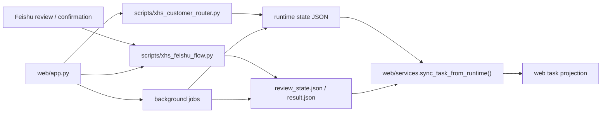

# Feishu Control Plane and Web Projection Design

## Goal

Make Feishu the primary control plane for the Wuhan Xiaohongshu workflow, while keeping the web app as a projection layer for rework, visual inspection, and operator convenience.

The design should preserve the current file-backed workflow, keep Feishu review and confirmation as the canonical operational path, and leave a clean extension point for future multi-account control.

## Explicit Requirements

- Feishu must remain the main place where review and confirmation decisions happen.
- The internal workflow state must stay synchronized between Feishu and the web app.
- The web app should primarily support rework, inspection, and visual adjustments to copy and images.
- The web app must not become a second workflow engine with its own competing source of truth.
- The design should stay compatible with the existing Wuhan tutoring workflow.
- The architecture should leave room for multiple Xiaohongshu accounts or control targets later.

## Inferred Priorities

- The user is trying to avoid two diverging control surfaces that can each claim to be "current."
- The most dangerous failure mode is state drift between Feishu, the runtime files, and the web task board.
- A mature solution here is not a bigger abstraction layer, but a stricter boundary between facts, projections, and commands.
- The first phase should optimize for operational clarity, not platform breadth.
- Multi-account support should be reserved in the data model before it is exposed in the UI.

## Current Reality

The current codebase already hints at the right shape, but the boundaries are still a little soft:

- `scripts/xhs_customer_router.py` owns the customer workflow state machine for topic, copywriting, cover, and graphics stages.
- `scripts/xhs_feishu_flow.py` owns the Feishu review-card lane, including `review_state.json` and `result.json`.
- `web/repository.py` stores a lightweight task registry in `web_tasks.json`.
- `web/services.py` already syncs runtime state into a web-facing task view model.
- `web/app.py` triggers router actions and background jobs from the web UI.
- `clients/wuhan-tutoring/state/feishu_dm/<open_id>.json` is the runtime state file that should be treated as the authoritative workflow record for a given thread.

The current implementation is close to a projection model, but it still leaves room for accidental ambiguity if task records start being treated as workflow truth.

## Design Summary

Use three distinct layers:

- Runtime facts
  - Customer state JSON, review state JSON, result JSON, and generated artifacts.
  - This is the source of truth.
- Control plane
  - Feishu review and confirmation actions.
  - This is where the operator gives canonical approvals or refresh requests.
- Projection layer
  - The web app shows a merged view of task registry plus runtime facts.
  - It can trigger commands, but it must not author workflow facts directly.

In other words:

- Feishu decides.
- Runtime files remember.
- Web shows and launches.

## Data Ownership

### Runtime facts

Owned by the workflow scripts and stored under the client state/session directories.

Primary fields:

- `current_state`
- `confirmed`
- `drafts`
- `materials_ready`
- `image_templates`
- `last_revision_scope`
- `last_user_intent`
- `session_output_dir`

Supporting artifacts:

- `review_state.json`
- `result.json`
- generated cover and graphic image files

### Task registry

Owned by `web/repository.py`.

The task record should behave like an indexed work item plus UI metadata, not like the workflow source of truth.

Recommended fields:

- `task_id`
- `client_slug`
- `account_key`
- `open_id`
- `title`
- `topic`
- `audience`
- `created_by_role`
- `status`
- `review_message_id`
- `session_output_dir`
- `client_change_request`
- `last_error`
- `created_at`
- `updated_at`

Fields derived from runtime facts should be treated as cached projections and can be overwritten on sync.

### Web projection

Owned by `web/services.py`.

The projection should merge:

- task registry fields
- runtime state
- review state
- result state

If values disagree, runtime wins.

## Data Flow

### Inbound sync

Whenever the web app renders a page or handles a command, it should re-read runtime state before presenting or persisting any view-layer updates.

### Outbound commands

When the web app triggers a workflow action, it should call the same workflow scripts the Feishu lane uses.

The web app can record:

- `client_change_request`
- `last_error`
- `status`

It should not directly mutate:

- `confirmed`
- `drafts`
- `current_state`
- `image_templates`

## Control Rules

### Feishu is canonical for review outcomes

The final meaning of approve / refresh / request-change comes from the Feishu lane. The web UI may expose those actions, but it should not invent alternate semantics.

### Web is a projection, not a parallel workflow

The web task board should be readable and actionable, but it should never become a second copy of the workflow engine.

### Runtime beats registry

If `web_tasks.json` and runtime state disagree, the next sync must favor runtime state and then update the projection.

### Missing state must fail softly

If review state or runtime state is missing, the web layer should show a blocked or stale projection rather than fabricating a stage or silently resetting the task.

### Multi-account support is a first-class extension point

Add `account_key` to the task model now, even if the first phase only uses one active account.

This keeps the design open for:

- one client workspace with multiple Xiaohongshu accounts
- multiple independent control targets later
- account-scoped access rules and task filtering

The first phase does not need an account-switching UI, but the schema should already be ready for it.

## Workflow Shape

The existing customer workflow stages remain:

- `state_0_topic`
- `state_1_copywriting`
- `state_2_cover`
- `state_3_graphics`
- `state_4_done`

The web app should mirror those stages as a projection. It should not define a separate stage system.

The Feishu review lane remains the operational control loop for:

- approving a draft
- refreshing cover images
- refreshing content graphics
- surfacing the final reviewed state

## Error Handling

- If `review_state.json` is missing, the app should mark the task as blocked or stale instead of guessing.
- If runtime state is newer than the web task record, the projection should update the web record on sync.
- If a web-triggered action is incompatible with the current runtime stage, the action should be rejected with a clear reason.
- If background execution fails, the failure should be recorded as a task/job error, not as a fake workflow transition.

## Migration Strategy

The transition should be incremental:

1. Keep the current file-backed workflow.
2. Make the web task board a read-through projection of runtime state.
3. Preserve backward compatibility for existing task records and review states.
4. Add `account_key` as a reserved field before exposing any multi-account UI.
5. Keep Feishu approval semantics unchanged while the web layer becomes a cleaner operator surface.

This avoids a disruptive rewrite and lets the current workflow keep shipping while the boundary gets sharper.

## Non-Goals

- No database introduction in this phase.
- No websocket or realtime push layer.
- No replacement of Feishu as the operator control surface.
- No separate workflow engine inside the web app.
- No multi-account dashboard UI in the first phase.
- No cross-client platform redesign.

## Verification Plan

- Confirm that web pages render from runtime snapshots rather than from stale task fields.
- Confirm that `sync` updates the task projection without mutating workflow facts.
- Confirm that Feishu-triggered changes are visible in the web app after sync.
- Confirm that web-triggered rework actions route through the workflow scripts and persist back to runtime.
- Confirm that tasks with no `account_key` still work as the single-account default.
- Confirm that existing tests continue to pass after adding the projection boundary.

## Risks

- If task records continue to be treated as authoritative, the system can drift back into two sources of truth.
- If future accounts are added without a stable `account_key`, state files and task projections may become mixed.
- If sync is optional rather than default, the web UI may show stale workflow data and confuse operators.
- If the web layer starts mutating runtime fields directly, it will bypass the control plane boundary this design is trying to establish.

## Recommended Implementation Order

1. Treat runtime state as the only workflow truth.
2. Tighten `web/services.py` so it reads runtime state into a projection model on every relevant request.
3. Keep `web/repository.py` focused on task indexing and UI metadata.
4. Make `web/app.py` route all operational actions through the workflow scripts.
5. Add `account_key` plumbing in the task model and service signatures without exposing a multi-account UI yet.
6. Add tests that prove projection sync wins over stale task fields.

